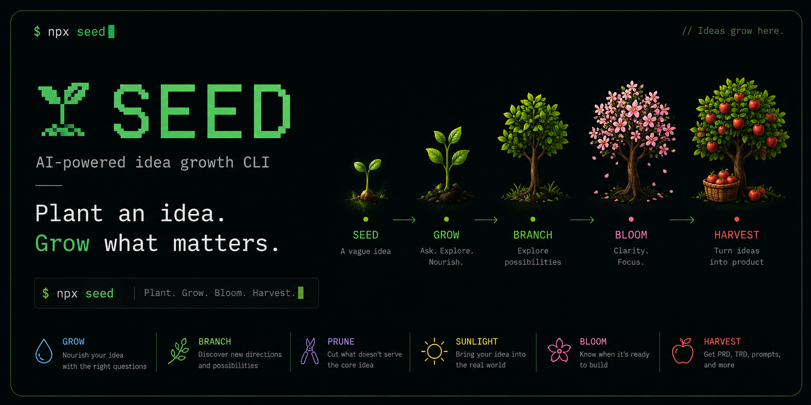

# 🌱 Seed

Plant an idea. Grow what matters.

**English | [한국어](./README.ko.md)**

<p align="center">
  
</p>

Seed is a terminal tool that turns a vague idea into a clear, buildable plan through simple, guided conversation. You don't need to know how to code, and you don't need a perfect idea to start — just say what's on your mind, and Seed asks one easy question at a time until your idea is ready to build.

When you're ready, Seed turns the conversation into real documents: a product plan, a technical outline, a README, and even a ready-to-paste prompt for AI coding tools like Claude Code, Cursor, or Codex.

**Seed never writes or edits your project's code.** It only asks questions, keeps notes, and produces documents when you ask for them.

## Why Seed

- **You don't need to be a developer.** Seed avoids technical jargon and asks about people, situations, and outcomes — not "scope" or "feasibility."
- **One question at a time.** No 20-question forms, no walls of text. Just a conversation.
- **Nothing is lost.** Every answer, every direction you tried, and every decision you made is saved locally and can be revisited.
- **You can always undo.** Trimmed-away ideas aren't deleted — they can be restored any time.
- **Honest feedback.** Seed points out contradictions and gaps instead of just cheering you on.
- **Works offline.** No AI account required — Seed includes a built-in local mode that works without any setup.

## Install

```bash
npm install -g @seed-cli/seed
```

Or try it once without installing:

```bash
npx @seed-cli/seed "An app that helps me remember to text my friends back"
```

Requires [Node.js](https://nodejs.org) 20 or newer.

## Getting started

Just tell Seed what's on your mind:

```bash
seed "An app that helps me remember to text my friends back"
```

The first time you run Seed, it asks which language you'd like to use (English or Korean) and how you'd like Seed to think — using a connected AI account or Seed's built-in offline mode, which needs no setup at all. You can change either choice later with `seed config`.

From there, just answer the questions Seed asks. There's no need to memorize commands — while you're talking with Seed, you can type things like `/branch`, `/bloom`, or `/harvest` to try other parts of the workflow, or just type `/help` to see what's available.

## How an idea grows

| Stage | Command | What it does |
|---|---|---|
| 🌱 Plant | `seed "your idea"` | Start a new idea from a sentence or two |
| 💧 Grow | `seed grow` | Answer one focused question at a time to sharpen the idea |
| 💧 Water | `seed water` | Look at the idea from a few different angles (user, value, first step, first moment) |
| 🌿 Branch | `seed branch` | Explore a few different directions the idea could go, without losing the original |
| ✂️ Prune | `seed prune` | Set aside parts that are too big for a first version (nothing is deleted) |
| ☀️ Sunlight | `seed sunlight` | Reality-check the idea against real users, alternatives, and constraints |
| 🌸 Bloom | `seed bloom` | Check whether the idea is ready to build, and see what's still unclear |
| 🍎 Harvest | `seed harvest` | Turn the idea into real documents once it's ready |

You don't have to follow this order strictly — `seed bloom` will always tell you what to explore next.

## Turning your idea into documents

Once your idea feels solid (`seed bloom` is a good way to check), harvest it:

```bash
seed harvest idea      # a one-page idea card
seed harvest brief     # a short project summary
seed harvest prd       # a full Product Requirements Document
seed harvest trd       # a Technical Requirements Document
seed harvest readme    # a project README
seed harvest prompt    # a ready-to-paste prompt for an AI coding assistant
seed harvest all       # generate everything above at once
```

Every harvest is saved to `.seed/harvest/` in your project folder, and running the same harvest again creates a new version (`prd-v1.md`, `prd-v2.md`, ...) instead of overwriting your previous one. Anything Seed doesn't know yet is marked `TBD` rather than invented.

The `prompt` document is especially useful if you want an AI coding tool to build the project for you — hand it directly to Claude Code, Cursor, Codex, or a similar assistant.

## Keeping track of multiple ideas

If you've planted more than one idea in different folders, `seed garden` shows all of them and lets you jump into any one:

```bash
seed garden
seed garden 2          # open the second idea listed
```

Not ready to work on an idea right now, but don't want to lose it? Set it aside:

```bash
seed wither            # put the idea to sleep (nothing is deleted)
seed wake              # pick it back up later
```

Want to see everything that happened to an idea — every question, branch, and decision?

```bash
seed history
seed tree              # a visual map of your idea and its directions
```

## Using your own AI

By default, Seed works entirely offline using built-in local logic — no account or API key needed. If you'd like sharper, more natural questions, you can connect an AI provider:

```bash
seed config
```

This opens a short setup wizard where you can choose:

- **OpenAI** — sign in with your account, or use an API key
- **Google Gemini** — API key
- **Anthropic Claude** — API key
- **A custom provider** — any OpenAI-compatible API (OpenRouter, Groq, a self-hosted model, etc.)
- **Local fallback** — no setup, works offline

API keys are only ever read from environment variables and are never written to disk. You can switch providers at any time, and Seed always keeps the offline mode available as a safety net if a request fails.

```bash
seed config list        # see what's configured
seed config test        # check that your active provider works
seed config use openai  # switch providers
```

## Language

Seed's interface is in English by default. To use Korean instead:

```bash
seed --lang ko
# or
SEED_LANG=ko seed
```

You can also set your language permanently with `seed config set lang ko`. Whatever language you type your idea in, Seed follows your lead when it asks questions and writes documents — the interface language and your idea's language are independent.

## Where does my data go?

Everything Seed knows about your idea lives in a `.seed/` folder inside your project — plain JSON and Markdown files, nothing hidden or sent anywhere unless you've connected an AI provider. Nothing outside that folder is ever touched; Seed never edits your source code or other project files.

## Command reference

```text
seed [idea]          Plant a new idea, or resume the current one
seed grow            Grow the idea with a focused question
seed water [lens]    Explore the idea from a different angle
seed branch          Explore an independent direction
seed prune           Set aside non-essential scope
seed sunlight        Reality-check against users and alternatives
seed evolve          Create the next generation of this idea
seed decide          Record a decision you've explicitly made
seed bloom           Check how ready the idea is
seed tree            View the idea and its branches
seed history         View everything that has happened so far
seed harvest [type]  Generate idea / brief / prd / trd / readme / prompt / all
seed garden          List and open nearby Seed projects
seed wither          Put the current idea to sleep
seed wake            Resume a sleeping idea
seed restore         Bring back a pruned branch or item
seed config          Set up or change your AI provider and language
```

Run any command with `--help` for its options, or `--json` for machine-readable output if you're scripting against Seed.

## Contributing

Interested in working on Seed itself? Here's how to build it from source and run the tests.

```bash
git clone https://github.com/hs-hui/seed.git
cd seed
npm install
npm run build
npm test
npm run dev -- --help   # run the CLI from source with tsx
```

MIT © Seed contributors
